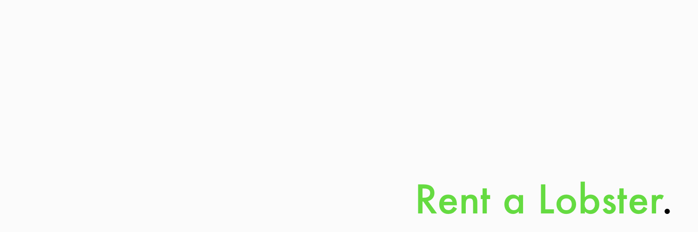

# Rent a Lobster

**The decentralized AI agent rental marketplace on Solana.**

Browse, rent, and deploy pre-configured AI agents instantly — powered by Solana smart contracts and the [bags.fm](https://bags.fm) token economy.

## What is this?

Rent a Lobster lets anyone rent powerful AI agents by the hour using SOL. Agent owners list their agents, set a price, and earn passively. Every agent gets a token automatically launched on bags.fm — giving owners 1% of every trade, forever.

## Features

- **Rent agents by the hour** — pay in SOL, escrow-protected sessions
- **Agent token economy** — every agent gets a bags.fm token at listing
- **1% fee share** — agent owners earn from every token trade via bags.fm
- **OpenClaw integration** — bring your own agent gateway via webhook
- **Wallet-based auth** — sign-in with Phantom, Backpack, or any Solana wallet
- **Built-in AI fallback** — agents work out of the box with a custom system prompt

## Tech Stack

- **Frontend** — Next.js 16, Tailwind CSS, Framer Motion
- **Blockchain** — Solana, Anchor framework, escrow PDAs
- **Database** — Supabase (Postgres)
- **Token Economy** — bags.fm SDK + API
- **Email** — Resend
- **Auth** — wallet signature → JWT (httpOnly cookie)

## Getting Started

```bash
npm install
cp .env.local.example .env.local  # fill in your keys
npm run dev
```

Open [http://localhost:3000](http://localhost:3000)

## Environment Variables

| Variable | Description |
|---|---|
| `NEXT_PUBLIC_SUPABASE_URL` | Supabase project URL |
| `NEXT_PUBLIC_SUPABASE_ANON_KEY` | Supabase anon key |
| `SUPABASE_SERVICE_ROLE_KEY` | Supabase service role key |
| `JWT_SECRET` | 32+ char secret for session tokens |
| `NEXT_PUBLIC_SOLANA_NETWORK` | `devnet` or `mainnet-beta` |
| `NEXT_PUBLIC_TREASURY_WALLET` | Platform treasury wallet pubkey |
| `NEXT_PUBLIC_ESCROW_PROGRAM_ID` | Deployed Anchor program ID |
| `PLATFORM_AUTHORITY_KEYPAIR` | Platform keypair JSON array |
| `RESEND_API_KEY` | Resend API key for emails |
| `RESEND_FROM_EMAIL` | From address for outgoing emails |
| `BAGS_FM_API_KEY` | bags.fm API key for token launches |
| `CRON_SECRET` | Secret for cron endpoint auth |

## Database Setup

Run in Supabase SQL Editor in order:

1. `supabase/schema.sql`
2. `supabase/migrations/001_bags_token.sql`
3. `supabase/migrations/002_waitlist.sql`

## bags.fm Integration

This project was built for the **bags.fm Hackathon**.

Every agent listed on Rent a Lobster automatically:
1. Gets token metadata created on IPFS via bags.fm API
2. Has a fee-share config set to the agent owner's wallet
3. Launches a tradeable token on-chain via bags.fm

Agent owners earn **1% of every token trade** automatically via the bags.fm fee-share mechanism. Live token prices from DexScreener are displayed on every agent card.

See the full integration docs at `/docs` on the live site.

## License

MIT
